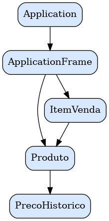

# 🧾 POC-PDV
**Prova de Conceito para Sistema de Ponto de Venda (PDV)**  
Projeto desenvolvido em **Java** com o objetivo de demonstrar a estrutura base de um sistema de PDV, incluindo controle de produtos, histórico de preços e registro de vendas.

---

## 🧠 Visão Geral
O **POC-PDV** é uma aplicação de exemplo (prova de conceito) que demonstra a arquitetura e os componentes essenciais de um sistema de **Ponto de Venda (PDV)**.  
O sistema foi construído em **Java**, seguindo o paradigma **orientado a objetos**, com classes que representam entidades do domínio de vendas, como **Produto**, **ItemVenda**, e **Histórico de Preço**, além de uma aplicação principal e interface de controle simples.

O foco está em demonstrar:  
- Modelagem de entidades comerciais.  
- Registro e atualização de preços com histórico.  
- Manipulação de vendas e itens.  
- Estrutura de aplicação modular em Java.

---

## 🧩 Estrutura do Projeto
```
src/
├── Application.java          # Classe principal — ponto de entrada do sistema
|── br
|    |── com
|         |── erick
|                 |── produtos
|                 |       |── ItemVenda.java            # Classe que representa um item dentro de uma venda
|                 |       ├── Produto.java              # Entidade que representa um produto com histórico de preços
|                 |       ├── PrecoHistorico.java       # Entidade que armazena as alterações de preço e data
|                 |── UI
|                     ├── ApplicationFrame.java         # Interface da aplicação / gerenciador de execução
```

---

## 🧱 Diagrama de Classes


---

## 🏗️ Componentes Principais
### **Produto**
Representa um produto no sistema, com atributos como:
- Nome
- Preço atual
- Histórico de preços (lista de `PrecoHistorico`)

Cada vez que o preço é atualizado, um novo registro é criado no histórico, mantendo rastreabilidade total de alterações.

---

### **PrecoHistorico**
Classe responsável por armazenar:
- Valor do preço em determinado momento.
- Data da modificação.

Permite acompanhar a evolução de preços ao longo do tempo.

---

### **ItemVenda**
Representa um item vendido, contendo:
- Referência ao produto.  
- Quantidade.  
- Cálculo automático do subtotal.

---

### **Application / ApplicationFrame**
São as classes de controle e inicialização da aplicação, que podem:
- Gerenciar a execução do PDV.  
- Coordenar as interações entre produtos, vendas e histórico.  
- Exibir ou registrar operações (em modo console ou gráfico, conforme expansão).

---

## ⚙️ Funcionalidades Implementadas
✅ Cadastro e manipulação de produtos.  
✅ Atualização automática de preço com armazenamento em histórico.  
✅ Estrutura para registro de vendas com itens.  
✅ Cálculo de totais e subtotais.  
✅ Base para futura integração com interface gráfica ou banco de dados.

---

## 🚀 Como Executar
1. **Clone o repositório**
   ```bash
   git clone https://github.com/AutoSync/POC-PDV.git
   cd POC-PDV
   ```
2. **Compile os arquivos Java**
   ```bash
   javac src/*.java
   ```
3. **Execute a aplicação**
   ```bash
   java -cp src Application
   ```
> 💡 Dica: você pode abrir o projeto diretamente em uma IDE (IntelliJ, Eclipse ou NetBeans) para facilitar a execução e depuração.

---

## 🧮 Exemplo de Uso
```java
Produto p1 = new Produto("Coca-Cola", 5.00);
p1.atualizarPreco(6.00); // Armazena o preço anterior no histórico

ItemVenda item = new ItemVenda(p1, 3);
System.out.println("Subtotal: R$" + item.getSubtotal());
```

Saída esperada:
```
Preço do produto atualizado: 5.0 → 6.0
Subtotal: R$18.0
```

---

## 🧱 Próximas Etapas
- [ ] Persistência em banco de dados (ex: SQLite ou MySQL).  
- [ ] Criação de interface gráfica completa (JavaFX ou Swing).  
- [ ] Módulo de vendas com controle de caixa.  
- [ ] Geração de relatórios e exportação de dados.  
- [ ] Integração de API / comunicação cliente-servidor.

---

## 🧑‍💻 Autor
Desenvolvido por **AutoSync** — Projeto de demonstração e estudo de arquitetura para PDVs em Java.

---

## 📜 Licença
Este projeto é distribuído sob a licença **MIT**.  
Sinta-se livre para utilizar, modificar e aprimorar o código para fins educacionais ou experimentais.
